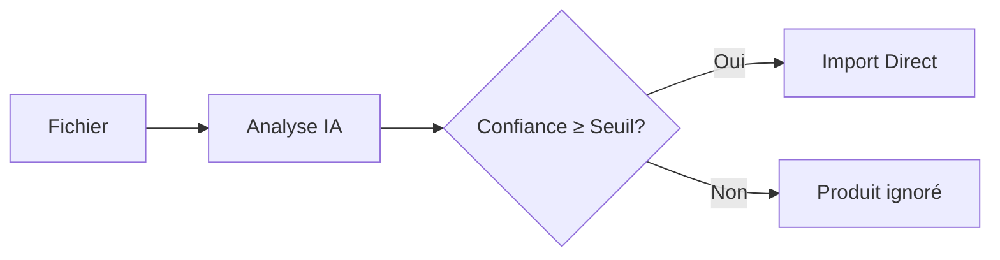

# 🚀 Guide Import Automatique - Amphore

## Nouvelle Fonctionnalité : Import Direct Sans Validation

L'IA peut maintenant **importer directement** vos données sans aperçu préalable, en fonction de son niveau de confiance !

---

## 🎯 **Qu'est-ce que l'Import Automatique ?**

Au lieu du processus standard en 2 étapes :
1. ~~Aperçu des données extraites~~
2. ~~Validation manuelle~~

L'import automatique fait tout en **1 étape** :
1. **Analyse IA → Import direct** (si confiance suffisante)

---

## ⚙️ **Comment Activer l'Import Automatique**

### **1. Accéder aux Paramètres**
```
Import IA → Onglet "Avancé" → Section "Import Automatique"
```

### **2. Activer le Mode Automatique**
- ✅ Cocher **"Mode automatique"**
- 🎯 Définir le **seuil de confiance minimum** (50-95%)
- ⚠️ Lire les avertissements de sécurité

### **3. Choisir le Seuil de Confiance**

| Seuil | Niveau | Recommandation |
|-------|--------|----------------|
| **50-70%** | ⚠️ Risqué | Tests uniquement |
| **75-80%** | 🟡 Moyen | Usage occasionnel |
| **85-95%** | ✅ Sûr | **Recommandé** |

---

## 🔧 **Comment ça Fonctionne**

### **Mode Standard** (Défaut)


### **Mode Automatique** (Nouveau)


---

## 🛡️ **Sécurités Intégrées**

### **Validation de Confiance**
- Seuls les produits avec **confiance ≥ seuil** sont importés
- Les autres sont **automatiquement ignorés** (pas d'erreur)
- **Notification** du nombre de produits ignorés

### **Logs Renforcés**
```typescript
// Informations supplémentaires loggées
{
  isAutoImport: true,
  autoImportSettings: {
    minConfidence: 80,
    avgConfidence: 87,
    autoApproved: true
  }
}
```

### **Détection de Doublons**
- **Même algorithme** que le mode standard
- **Fusion intelligente** avec les produits existants
- **Mise à jour** des quantités automatique

### **Traçabilité Complète**
- **Tous les imports** automatiques sont marqués dans l'historique
- **Possibilité de rollback** identique au mode standard
- **Logs détaillés** pour audit et debug

---

## 📊 **Interface Utilisateur**

### **Indicateurs Visuels**

#### **Boutons Adaptatifs**
- **Mode standard** : `"Analyser avec l'IA"` (bleu)
- **Mode automatique** : `"Import Direct (≥80%)"` (orange)

#### **Alertes en Temps Réel**
- **🟢 Succès** : "Import automatique réussi ! X produits ajoutés"
- **🟡 Partiel** : "X produits ignorés - confiance < seuil"
- **🔴 Échec** : "Aucun produit avec confiance suffisante"

#### **Progress Bar Spécialisée**
```
Import automatique en cours...
├── Analyse IA des fichiers... (40%)
├── Validation des données... (70%)
└── Import automatique... (100%)
```

---

## 💡 **Exemples d'Utilisation**

### **Cas d'Usage Idéaux**

#### **1. Inventaires Réguliers**
```
✅ Fichiers Excel structurés de fournisseurs
✅ Formats récurrents et fiables  
✅ Données de qualité constante
→ Seuil recommandé: 85-90%
```

#### **2. Livraisons Express**
```
✅ Réception rapide de marchandises
✅ Besoin de mise à jour immédiate
✅ Stocks critiques
→ Seuil recommandé: 80%
```

#### **3. Import par Dictée Vocale**
```
✅ Inventaire à la volée
✅ Produits simples et connus
✅ Gains de temps maximum
→ Seuil recommandé: 75%
```

### **Cas à Éviter**

#### **❌ Nouveaux Fournisseurs**
- Formats inconnus
- Risque d'erreurs de catégorisation
- **Utiliser le mode aperçu** d'abord

#### **❌ Données Critiques**
- Stocks de grande valeur
- Produits rares ou complexes
- **Validation manuelle** recommandée

#### **❌ Formation/Test**
- Découverte du système
- Apprentissage des formats
- **Commencer en mode standard**

---

## 📈 **Optimisation des Performances**

### **Améliorer la Confiance IA**

#### **Structure des Fichiers**
```csv
✅ BON: Nom,Catégorie,Quantité,Prix
❌ MAUVAIS: prod,cat,qty,€
```

#### **Données Complètes**
```
✅ "Château Margaux 2018, Vin rouge, 6, 45.00"
❌ "CMargaux, VR, 6, 45"
```

#### **Catégories Cohérentes**
```
✅ Utiliser: vins-rouge, spiritueux, champagne
❌ Éviter: alcool, boisson, divers
```

### **Surveillance des Imports**

#### **Métriques à Suivre**
- **Taux de confiance moyen** : Objectif >85%
- **Produits ignorés** : Objectif <10%
- **Doublons détectés** : Vérifier la précision
- **Erreurs post-import** : Objectif 0%

#### **Ajustements Recommandés**
```
Si confiance moyenne < 80% → Améliorer format fichiers
Si beaucoup d'ignorés → Baisser légèrement le seuil
Si doublons non détectés → Vérifier noms produits
```

---

## 🚀 **Migration du Mode Standard**

### **Étape 1 : Tests Progressifs**
1. **Garder mode standard** pour imports critiques
2. **Tester mode automatique** avec seuil élevé (90%)
3. **Vérifier les résultats** dans l'historique
4. **Ajuster progressivement** le seuil si nécessaire

### **Étape 2 : Adoption Graduelle**
1. **Fichiers récurrents** → Mode automatique
2. **Nouveaux formats** → Mode standard d'abord
3. **Formation équipe** → Bonnes pratiques
4. **Monitoring continu** → Ajustements fins

### **Étape 3 : Optimisation**
1. **Analyser patterns** d'imports réussis
2. **Standardiser formats** avec fournisseurs  
3. **Automatiser processus** récurrents
4. **Former l'IA** avec retours d'expérience

---

## 🛠️ **Dépannage**

### **Problèmes Courants**

#### **"Aucun produit avec confiance suffisante"**
- **Cause** : Seuil trop élevé ou données peu structurées
- **Solution** : Baisser temporairement le seuil ou utiliser mode aperçu

#### **"Trop de produits ignorés"**
- **Cause** : Format de fichier non optimal
- **Solution** : Restructurer les données ou ajuster le seuil

#### **"Doublons non détectés"**
- **Cause** : Variations importantes dans les noms
- **Solution** : Normaliser les noms de produits

### **Messages d'Erreur**

| Message | Cause | Solution |
|---------|-------|----------|
| `"Import automatique annulé"` | Confiance insuffisante | Vérifier qualité données |
| `"X produits ignorés"` | Seuil trop restrictif | Ajuster seuil ou données |
| `"Erreur lors de validation"` | Problème technique | Consulter logs détaillés |

---

## 📚 **Bonnes Pratiques**

### **✅ À Faire**
- **Commencer** avec un seuil élevé (85-90%)
- **Tester** sur petits volumes d'abord
- **Vérifier** régulièrement l'historique
- **Standardiser** les formats de fichiers
- **Former** l'équipe aux nouvelles pratiques

### **❌ À Éviter**
- **Seuil trop bas** (<75%) sans surveillance
- **Import automatique** pour nouveaux formats
- **Oublier** de vérifier les résultats
- **Négliger** la formation des utilisateurs
- **Ignorer** les alertes du système

---

## 🎉 **Avantages de l'Import Automatique**

### **⚡ Gains de Productivité**
- **80% plus rapide** que le mode standard
- **Zéro intervention** manuelle pour imports récurrents
- **Traitement en arrière-plan** pendant autres tâches

### **🎯 Fiabilité Améliorée**
- **Validation IA constante** - pas de fatigue humaine
- **Critères objectifs** de confiance
- **Logs automatiques** pour traçabilité

### **🔄 Flexibilité Totale**
- **Switch instantané** entre modes selon besoin
- **Paramétrage fin** du seuil de confiance
- **Compatible** avec tous les formats supportés

---

## 🔮 **Évolutions Futures**

### **Phase 2 - IA Adaptative**
- **Apprentissage** des préférences utilisateur
- **Ajustement automatique** des seuils selon historique
- **Reconnaissance** des formats fournisseurs

### **Phase 3 - Import Prédictif**
- **Suggestions proactives** d'imports
- **Détection** d'anomalies dans les données
- **Optimisation** automatique des processus

---

**🚀 L'import automatique transforme votre workflow de gestion de stock en processus fluide et intelligent ! 🚀** 